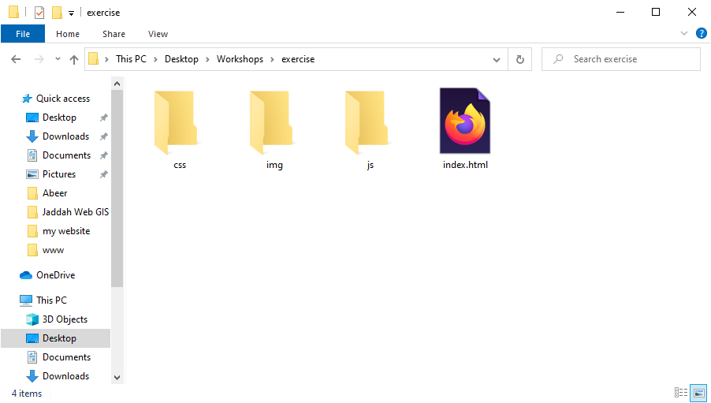
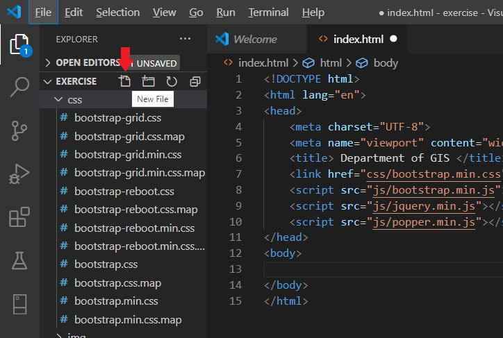

# Create landing Website using HTML, CSS, JavaScript, jQuery and Bootstrap
* In this exercise, we will create a simple landing website using bootstrap; following are the structure of our website.



* Download bootstrap 4, jQuery and Popper.min.js. Put the bootstrap’s JS files, jquery.min.js and popper.min.js inside the js folder and bootstrap’s CSS files inside css folder.
* Open the project directory in Visual Studio Code and press [SHIFT + !] to generate the basic HTML code and change the title to Department of GIS.

```html
<!DOCTYPE html>
<html lang="en">
<head>
    <meta charset="UTF-8">
    <meta name="viewport" content="width=device-width, initial-scale=1.0">
    <title> Department of GIS </title>
</head>
<body>
    
</body>
</html>
```

* Inside the head section, include bootstrap, jQuery and popper.js.

```html
    <link href="css/bootstrap.min.css" rel="stylesheet" />
    <script src="js/bootstrap.min.js"></script>
    <script src="js/jquery.min.js"></script>
    <script src="js/popper.min.js"></script>
```

* We will add the navbar to our index.html page, inside the body tag add the following code.

```html
<!-- navbar -->  
 <nav class="navbar navbar-expand-lg fixed-top ">  
    <a class="navbar-brand" href="#">Home</a>
   <button class="navbar-toggler" type="button" data-toggle="collapse" data-target="#navbarSupportedContent" aria-controls="navbarSupportedContent" aria-expanded="false" aria-label="Toggle navigation">  
    <span class="navbar-toggler-icon"></span></button>
   <div class="collapse navbar-collapse " id="navbarSupportedContent">
       <ul class="navbar-nav mr-4">
           <li class="nav-item"><a class="nav-link" data-value="about" href="#">About</a></li>
           <li class="nav-item"><a class="nav-link " data-value="portfolio"href="#">Portfolio</a></li>
           <li class="nav-item"><a class="nav-link " data-value="team" href="#">Team</a></li>
           <li class="nav-item"><a class="nav-link " data-value="contact" href="#">Contact</a></li> 
        </ul> 
   </div>
</nav>
<!-- End of navbar -->

```

* Inside css folder create a new file and use main.css as name, in Visual Studio Code, Open the explorer panel and click on css folder and click on the new file icon to create a new file.




* Include the main.css inside head section in your index.html page.

```html
<link rel="stylesheet" type="text/css" href="css/main.css">
```

* Inside main.css file add the following code to customize the navbar.

```css
.navbar{ background:#F97300;}
.nav-link , .navbar-brand{ color: #f4f4f4; cursor: pointer;}
.nav-link{ margin-right: 1em !important;}
.nav-link:hover{ background: #f4f4f4; color: #f97300; }
.navbar-collapse{ justify-content: flex-end;}
.navbar-toggler{  background:#fff !important;}

```

* Add header in your index.html page under navbar, write the following code to add the header.

```html
<header class="header">
  
</header>

```

* We want to make sure the header takes up the window’s height so we are going to use a little JQuery code. First, create a file named main.js and include it in the index.html file before the closing body tag:

```html
<script type="text/javascript" src='js/main.js'></script>
```

* In the main.js file insert this a little code of JQuery:

```javascript
$(document).ready(function(){
    $('.header').height($(window).height()); 
});

```

* Open the main.css and add the following code to add background image for the header.

```css
/*header style*/
.header{
    background-image: url('../img/header.jpg');
    background-attachment: fixed;
    background-size: cover;
    background-position: center;
}
```

* Add the following code inside the header element in your index.html page 

```html
<header class="header">
    <div class="overlay"></div>
    <div class="container">
        <div class="description ">
            <h1> Welcome to Department of GIS and RS
             <p>The Department of GIS and RS deals with botanical applications of Geographical Information Systems (GIS) and Remote sensing (RS) methods.</p>
             <button class="btn btn-outline-secondary btn-lg">See more</button>
            </h1>  
         </div>
    </div>
</header>

```

* Open the main.css and write the following code to customize the header element.

```css
.overlay{
    position: absolute;
    min-height: 100%;
    min-width: 100%;
    left: 0;
    top: 0;
    background: rgba(244, 244, 244, 0.79);
}
.description{
    position: absolute;
    top: 30%;
    margin: auto;
    padding: 2em;
}
.description h1{
 color:#F97300 ;
}
.description p{
 color:#666;
 font-size: 20px;
 width: 50%;
 line-height: 1.5;
}
.description button{
 border:1px  solid #F97300;
 background:#F97300;
 color:#fff;
}

```

* Now we will create the about section, In this section, we will use some Bootstrap Grid to divide the section into two parts. To start our grid, we have to assign the .row class to the parent div.

```html
<!-- About Section -->
<div class="about">
<div class="container">
<h1 class="text-center">About</h1>
<div class="row">
    <div class="col-lg-4 col-md-4 col-sm-12">
     
     <span class="text-justify"> RS & Web GIS Develop </span>
    </div>
    <div class="col-lg-8 col-md-8 col-sm-12 desc">
      
     <h3> Department of GIS </h3>
     <p>
        ipsum dolor sit amet, consectetur adipisicing elit, sed do eiusmod
      tempor incididunt ut labore et dolore magna aliqua. Ut enim ad minim veniam,
      quis nostrud exercitation ullamco laboris nisi ut aliquip ex ea commodo
      consequat. Duis aute irure dolor in reprehenderit in voluptate velit esse
      cillum dolore eu fugiat nulla pariatur. Excepteur sint occaecat cupidatat non
      proident, sunt in culpa qui officia deserunt mollit anim id est laborum.
     </p>
    </div>
   </div>
</div>
</div>
```
* Add the following code to main.css to customize the about section.
```css
.about{
    margin: 4em 0;
    padding: 1em;
    position: relative;
   }
   .about h1{
    color:#F97300;
    margin: 2em;
   }
   .about img{
    height: 100%;
       width: 100%;
       border-radius: 50%
   }
   .about span{
    display: block;
    color: #888;
    position: absolute;
    left: 115px;
   }
   .about .desc{
    padding: 2em;
    border-left:4px solid #10828C;
   }
   .about .desc h3{
    color: #10828C;
   }
   .about .desc p{
    line-height:2;
    color:#888;
   }

```

* Now we will create the portfolio section, write the following code to create the portfolio section in your index.hml.

```html
<!-- portfolio -->
<div class="portfolio">
    <h1 class="text-center">Portfolio</h1>
<div class="container">
 <div class="row">
  <div class="col-lg-4 col-md-4 col-sm-12">
   
  </div>
  <div class="col-lg-4 col-md-4 col-sm-12">
   
  </div>
  <div class="col-lg-4 col-md-4 col-sm-12">
   
  </div>
     
<div class="col-lg-4 col-md-4 col-sm-12">
   
  </div>
  <div class="col-lg-4 col-md-4 col-sm-12">
   
  </div>
  <div class="col-lg-4 col-md-4 col-sm-12">
   
  </div>
     
 </div>
</div>
</div>

```

* Add the following code in main.css to customize the portfolio section.

```css
/*Portfolio*/
.portfolio{
    margin: 4em 0;
       position: relative; 
   }
   .portfolio h1{
    color:#F97300;
    margin: 2em; 
   }
   .portfolio img{
     height: 15rem;
     width: 100%;
     margin: 1em;
     
   }

```

* Add the following code in your index.html to add the team section in your website:

```html
<!-- Team section -->
<div class="team" id="team">
    <div class="container">
       <h1 class="text-center">Our Team</h1>
     <div class="row">
      <div class="col-lg-3 col-md-3 col-sm-12 item">
       
       <div class="des">
         Amani 
        </div>
       <span class="text-muted">Manager</span>
      </div>
      <div class="col-lg-3 col-md-3 col-sm-12 item">
       
       <div class="des">
          Fatima
        </div>
       <span class="text-muted">S.Enginner</span>
      </div>
      <div class="col-lg-3 col-md-3 col-sm-12 item">
       
       <div class="des">
         Layla 
        </div>
       <span class="text-muted">Front End Developer</span>
      </div>
      <div class="col-lg-3 col-md-3 col-sm-12 item">
       
        <div class="des">
         Amjad
        </div>
       <span class="text-muted">Team Manger</span>
      </div>
     </div>
    </div>
   </div>
   ```
   
   * Add the following code to main.css to customize the team section.
   
   ```css
   team{
    margin: 4em 0;
    position: relative;  
   }
   .team h1{
    color:#F97300;
    margin: 2em; 
   }
   .team .item{
    position: relative;
   }
   .team .des{
    background: #F97300;
    color: #fff;
    text-align: center;
    border-bottom-left-radius: 93%;
    transition:.3s ease-in-out;
    
   }

   ```
   
* Now we will add the last section, contact form, The Contact Form section will contain a form through which visitors can send an email or give feedback. In your index.html write the following code to add the contact form section.

```html
<!-- Contact form -->
<div class="contact-form">
    <div class="container">
        <h1 class="text-center">Contact Us</h1>
     <form>
      <div class="row">
       <div class="col-lg-4 col-md-4 col-sm-12">
         <h1>Get in Touch</h1> 
       </div>
       <div class="col-lg-8 col-md-8 col-sm-12 right">
          <div class="form-group">
            <input type="text" class="form-control form-control-lg" placeholder="Your Name" name="">
          </div>
          <div class="form-group">
            <input type="email" class="form-control form-control-lg" placeholder="YourEmail@email.com" name="email">
          </div>
          <div class="form-group">
            <textarea class="form-control form-control-lg">
             
            </textarea>
          </div>
          <input type="submit" class="btn btn-secondary btn-block" value="Send" name="">
       </div>
      </div>
     </form>
    </div>
   </div>

```

* Add the following code to main.css to customize the contact form.

```css
.contact-form{
    margin: 6em 0;
    position: relative;  
   }
   
   .contact-form h1{
    padding:2em 1px;
    color: #F97300; 
   }
   .contact-form .right{
    max-width: 600px;
   }
   .contact-form .right .btn-secondary{
    background:  #F97300;
    color: #fff;
    border:0;
   }
   .contact-form .right .form-control::placeholder{
    color: #888;
    font-size: 16px;
   }

```


