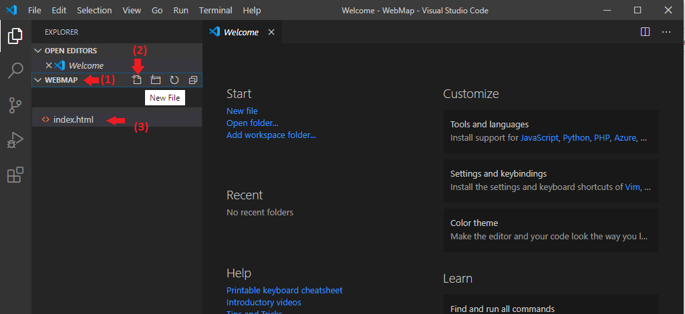
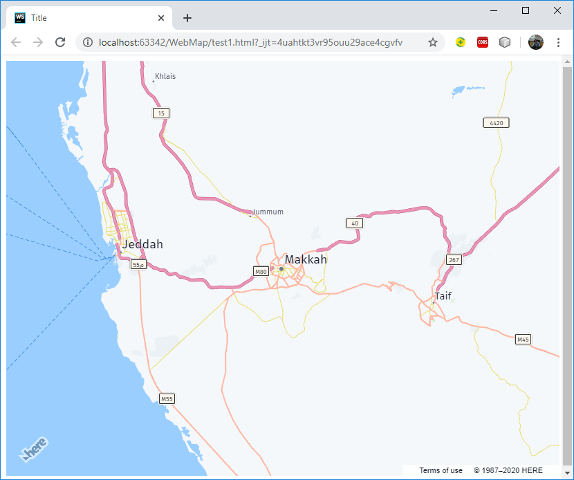
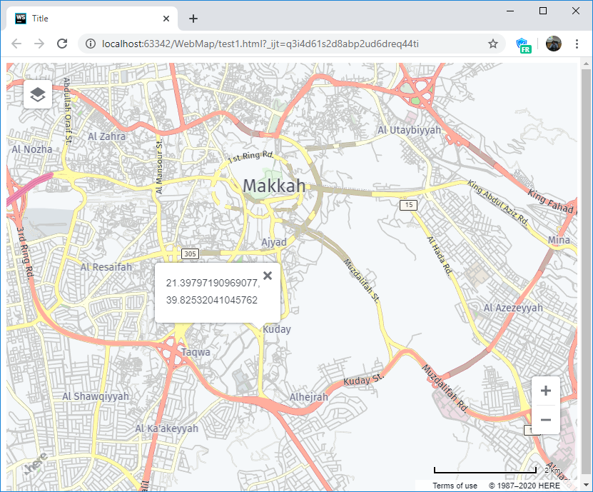

# Introduction to HERE Map API
* OPen Visual Studio Code and Create a New Folder and Inside created folder create a new file use index.html as file name.



* In index.html press SHIFT + ! to generate the basic HTML code, and change the page title to Here Map API.
```html
<!DOCTYPE html>
<html lang="en">
<head>
    <meta charset="UTF-8">
    <meta name="viewport" content="width=device-width, initial-scale=1.0">
    <title> Here Map API </title>
</head>
<body>
    
</body>
</html>
```

* Inside the head section, we will include the HERE Map API mapsjs-core.js, mapjs-service.js.

```html
<script src="https://js.api.here.com/v3/3.1/mapsjs-core.js"></script>
<script src="https://js.api.here.com/v3/3.1/mapsjs-service.js"></script>
```

* We will add a container to show our map, we will use <div> element to create the map container, set id attribute to "mapDiv".

```html
<div id="mapContainer" style="width: 800px; height: 600px;"></div>
```

* After div element we will open script tag, and inside the script tag, add a the following code to create 


```javascript

var platform = new H.service.Platform({
	'apikey': 'YOUR API KEY'
});

```

* Add the following code to 

```javascript
var layers = platform.createDefaultLayers();
```

* Create a map object

```javascript
var map = new H.Map(
	document.getElementById('mapContainer'),
	layers.vector.normal.map,
	{
		zoom: 9,
		center:{lat:21.422542, lng:39.826230}
	}
);
```

* following are the full code of our web map page.

```html
<!DOCTYPE html>
<html lang="en">
<head>
    <meta charset="UTF-8">
    <meta name="viewport" content="initial-scale=1.0, width=device-width" />
    <title>Title</title>
    <script src="https://js.api.here.com/v3/3.1/mapsjs-core.js"></script>
    <script src="https://js.api.here.com/v3/3.1/mapsjs-service.js"></script>
</head>
<body>
<div id="mapContainer" style="width: 800px; height: 600px;"></div>
<script>
    var platform = new H.service.Platform({
        'apikey':'PUT YOUR API KER HERE'
    });
    var layers = platform.createDefaultLayers();
    var map = new H.Map(
        document.getElementById('mapContainer'),
        layers.vector.normal.map,
        {
            zoom: 9,
            center:{lat:21.422542, lng:39.826230}
        }
    );
</script>
</body>
</html>
```

* Open your index.html in your web browser, your web page should look like the following figure.




## Add UI controls
* HERE MAP API provide a UI control for mapping these controls include (MapSettingControl, ZoomControl and ScalebarControl), to add the UI control we must include mapsjs-ui.js and mapsjs-ui.css files n our web page.
```html
<script src="https://js.api.here.com/v3/3.1/mapsjs-ui.js"></script>
<link rel="stylesheet" href="https://js.api.here.com/v3/3.1/mapsjs-ui.css" />
```

* To add UI controls to our web map, add the following code

```javascript
var ui = new H.ui.UI.createDefault(map, layers);
```

* You can customize the UI controls such as change the position of UI controls, the following code used to change the position of mapsettings control.

```javascript
ui.getControl('mapsettings').setAlignment('top-left');
```

## Add InfoBubble
* InfoBubble used to show information on the map, to add infoBubble to your web page write the following code:

```javascript
var bubble = new H.ui.InfoBubble(
    {lat:21.422542,lng:39.826230},
    {content:'<b>MAKKA</b>'}
);
ui.addBubble(bubble);

```

## Map Events
* Map events is used to add interactions to your web page, to add map events we must include mapsjs-mapevents.js in our web page.
```html
<script src="https://js.api.here.com/v3/3.1/mapsjs-mapevents.js"></script>
```

* to enable users to use map move events we will add the following code to our web page.

```javascript
var mapEvents = new H.mapevents.MapEvents(map);
var behavior = new H.mapevents.Behavior(mapEvents);
```

* Following code will add map click event, when user click on the map the infoBubble appear and shows the coordinates of location where the user clicked. 

```javascript
map.addEventListener('tap',function(evt){
    var coords = map.screenToGeo(
        evt.currentPointer.viewportX,
        evt.currentPointer.viewportY
    );
    let bubble = new H.ui.InfoBubble(
        {lat: coords.lat , lng: coords.lng},
        {content: coords.lat + ', ' + coords.lng}
    );
    ui.addBubble(bubble);
});
```

* Your web page should look like the following figure.

