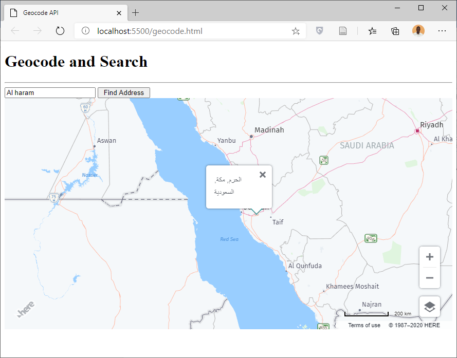
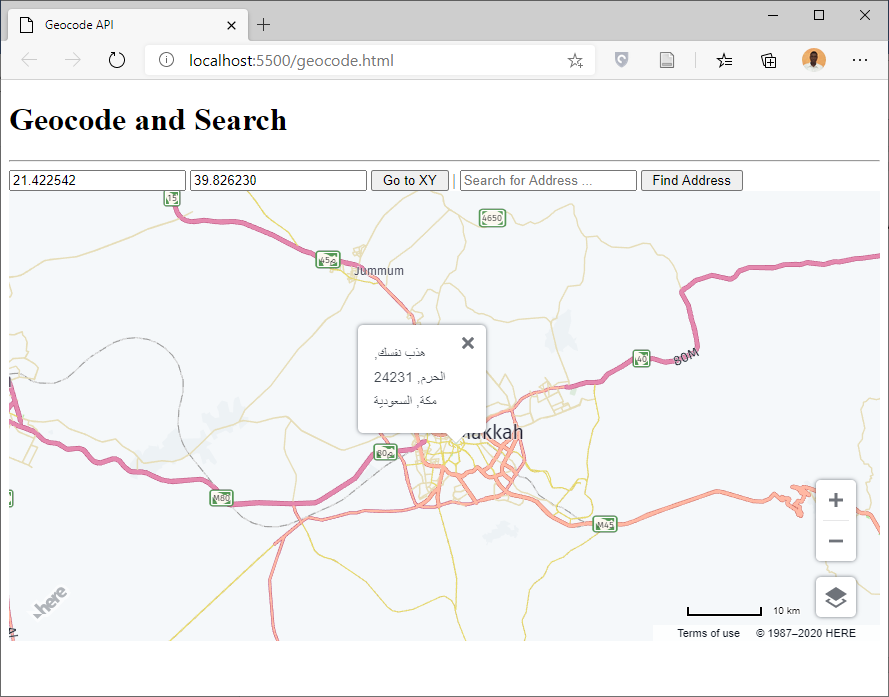

# Geocdes

* HERE MAPS API provide Geocoding capabilities, we will use instance from getSearchService() to perform Geocoding operations, in Geocding we will text address and get the location information.

* Open Visual Studio Code, Open Your Project Folder and Create a new File use geocode.html as file name.

* In geocode.html page press SHIFT + ! to generate the HTML code and change the titlr to Geocode and Search.

```html
<!DOCTYPE html>
<html lang="en">
<head>
    <meta charset="UTF-8">
    <meta name="viewport" content="width=device-width, initial-scale=1.0">
    <title> Geocode API </title>
</head>
<body>
    
</body>
</html>
```

* Inside head section include HERE MAPS API libraries.

```html
<script src="https://js.api.here.com/v3/3.1/mapsjs-core.js"></script>
<script src="https://js.api.here.com/v3/3.1/mapsjs-service.js"></script>
<script src="https://js.api.here.com/v3/3.1/mapsjs-ui.js"></script>
<script src="https://js.api.here.com/v3/3.1/mapsjs-mapevents.js"></script>
<link rel="stylesheet" href="https://js.api.here.com/v3/3.1/mapsjs-ui.css" />
```

* Inside the body section add h1 and div elements and use mapDiv as id for the div element.

```html
<h1> Geocode and Search </h1><hr />
<div id="mapDiv" style="height: 450px;"></div>
```

* Now open script tag and Add Here Map, UI controls and Map Events.

```html
<script>
	var platform = new H.service.Platform({
		'apikey': 'YOUR API KEY'
	});
	var layers = platform.createDefaultLayers();
	var map = new H.Map(
		document.getElementById('mapDiv'),
		layers.vector.normal.map,
		{
			zoom: 6,
			center: {lat: 21.4321, lng: 39.4321}
		}
	);
	var ui = new H.ui.UI.createDefault(map, layers);
	var mapEvents = new H.mapevents.MapEvents(map);
	var behavior = new H.mapevents.Behavior(mapEvents);

</script>
```

* Now we will create an Object from getSearchService() and type the following code to search for Alharam Mecca.

```javascript

var service = platform.getSearchService();
service.geocode({q: 'Al Haram, Mecca 24231, Saudi Arabia'}, (result)=>{
	result.items.forEach((item)=>{
		map.addObject(new H.map.Marker(item.position));
	});
}, (error)=>{
	alert(error);
});

```

* Let us to some modification on the above code to make it more interactive.

* Inside under h1 element add input text and button.

```html
<input type="text" id="txt" placeholder="Search for Address ... ">
<input type="button" id="btn" value=" Find Address " onclick="find();">
```
* Now we will create find() function and we will put the code of geocoding task inside this function like the following code.

```javascript

var service = platform.getSearchService();
function find(){
	var txt = document.getElementById('txt').value ;
	service.geocode({q: txt}, (result)=>{
		result.items.forEach((item)=>{
			map.addObject(new H.map.Marker(item.position));
		});
	}, (error)=>{
		alert(error);
	});
}

```



## Reverse Geocde 

* Geocding enable you to reverse Geocde by using reverseGeocode method, the following example explain how to find reverse geocode, in reverse Geocde we enter coordinates and gets Descriptive Information.

```javascript

service.reverseGeocode({at: '21.422542,39.826230'}, (result)=>{
	result.items.forEach((item)=>{
		ui.addBubble(new H.ui.InfoBubble(item.position, 
		{content: item.address.label}));
	});
},(error)=>{
	alert(error);
});

```

* let us to make it more attractive, under h1 element add  two input text and button.

```html
<input type="text" id="lat" placeholder="Enter Latitude ...">
<input type="text" id="lng" placeholder="Enter Longitude ...">
<input type="button" id="btn1" value=" Go to XY " onclick="goToXY();">
| 
```

* Now let us to create goToXY() function.

```javascript

function goToXY(){
	var lat = document.getElementById('lat').value;
	var lng = document.getElementById('lng').value;
	var atTxt = parseFloat(lat)+','+parseFloat(lng);
	service.reverseGeocode({at: atTxt}, (result)=>{
		result.items.forEach((item)=>{
			ui.addBubble(new H.ui.InfoBubble(item.position, 
			{content: item.address.label}));
		});
	},(error)=>{
		alert(error);
	});
}

```


