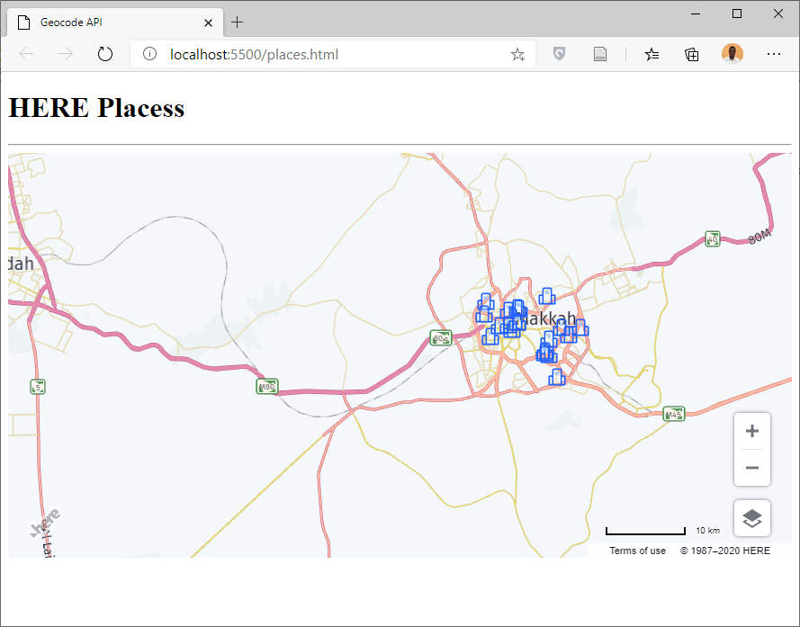

# Places

* HERE MAPS API enables GIS Developer to create application to search for HERE Points of Interest (POIs) and get detailed Infromation about places, we will use instance from getPlacesService() to Search in HERE Places.

* Open Visual Studio Code, Open Your Project Folder and Create a new File use places.html as file name.

* In places.html page press SHIFT + ! to generate the HTML code and change the titlr to Geocode and Search.

```html
<!DOCTYPE html>
<html lang="en">
<head>
    <meta charset="UTF-8">
    <meta name="viewport" content="width=device-width, initial-scale=1.0">
    <title> Geocode API </title>
</head>
<body>
    
</body>
</html>
```

* Inside head section include HERE MAPS API libraries.

```html
<script src="https://js.api.here.com/v3/3.1/mapsjs-core.js"></script>
<script src="https://js.api.here.com/v3/3.1/mapsjs-service.js"></script>
<script src="https://js.api.here.com/v3/3.1/mapsjs-ui.js"></script>
<script src="https://js.api.here.com/v3/3.1/mapsjs-mapevents.js"></script>
<link rel="stylesheet" href="https://js.api.here.com/v3/3.1/mapsjs-ui.css" />
```

* Inside the body section add h1 and div elements and use mapDiv as id for the div element.

```html
<h1> HERE Places </h1><hr />
<div id="mapDiv" style="height: 450px;"></div>
```

* Now open script tag and Add Here Map, UI controls and Map Events.

```html
<script>
	var platform = new H.service.Platform({
		'apikey': 'YOUR API KEY'
	});
	var layers = platform.createDefaultLayers();
	var map = new H.Map(
		document.getElementById('mapDiv'),
		layers.vector.normal.map,
		{
			zoom: 10,
			center: {lat: 21.4321, lng: 39.4321}
		}
	);
	var ui = new H.ui.UI.createDefault(map, layers);
	var mapEvents = new H.mapevents.MapEvents(map);
	var behavior = new H.mapevents.Behavior(mapEvents);

</script>
```

* Places in HERE are classified in category.

* [You Can find all places categories in the following link, change {YOUR_API_KEY} by your API Key.](https://places.ls.hereapi.com/places/v1/categories/places?at=21.422542,39.826230&apiKey={YOUR_API_KEY})

* Now we will create an Object from getPlacesService() and type the following show all hospitals around Mecca.


```javascript
var placesService = platform.getPlacesService();
var parameters = {'at':'21.422542,39.826230', 'cat':'hospital-health-care-facility'};
placesService.explore(parameters, (results)=>{
	var resultGroup = new H.map.Group();
	var items = results.results.items ;
	items.forEach((item)=>{
		let position = {lat: item.position[0], lng: item.position[1]};
		let data = item.title ;
		let icon = new H.map.Icon('hospital.png', {size:{w:20,h:20}});
		let marker = new H.map.Marker(position, {icon: icon});
		marker.setData(data);
		resultGroup.addObject(marker);
	});
	map.addObject(resultGroup);
},(error)=>{
	alert(error);
});

```

* Let us to add the following event to show the title of location on click event.

```javascript

map.addEventListener('tap', (event)=>{
	if (event.target instanceof H.map.Marker) {
		var bubble =  new H.ui.InfoBubble(event.target.getGeometry(), {
			content: event.target.getData()
		});
		ui.addBubble(bubble);
	}
});

```


