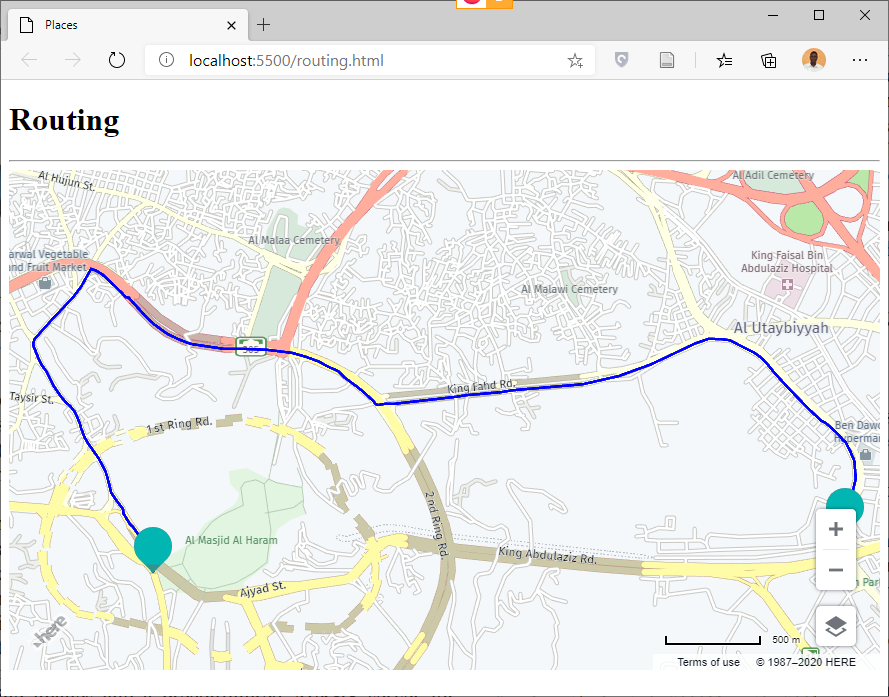

# Places

* HERE MAPS API enables GIS Developer to create application to use API that offers easy and fast routing for several regions in the world.

* Open Visual Studio Code, Open Your Project Folder and Create a new File use routing.html as file name.

* In routing.html page press SHIFT + ! to generate the HTML code and change the titlr to Routing.

```html
<!DOCTYPE html>
<html lang="en">
<head>
    <meta charset="UTF-8">
    <meta name="viewport" content="width=device-width, initial-scale=1.0">
    <title> Routing </title>
</head>
<body>
    
</body>
</html>
```

* Inside head section include HERE MAPS API libraries.

```html
<script src="https://js.api.here.com/v3/3.1/mapsjs-core.js"></script>
<script src="https://js.api.here.com/v3/3.1/mapsjs-service.js"></script>
<script src="https://js.api.here.com/v3/3.1/mapsjs-ui.js"></script>
<script src="https://js.api.here.com/v3/3.1/mapsjs-mapevents.js"></script>
<link rel="stylesheet" href="https://js.api.here.com/v3/3.1/mapsjs-ui.css" />
```

* Inside the body section add h1 and div elements and use mapDiv as id for the div element.

```html
<h1> Routing </h1><hr />
<div id="mapDiv" style="height: 450px;"></div>
```

* Now open script tag and Add Here Map, UI controls and Map Events.

```html
<script>
	var platform = new H.service.Platform({
		'apikey': 'YOUR API KEY'
	});
	var layers = platform.createDefaultLayers();
	var map = new H.Map(
		document.getElementById('mapDiv'),
		layers.vector.normal.map,
		{
			zoom: 10,
			center: {lat: 21.4321, lng: 39.4321}
		}
	);
	var ui = new H.ui.UI.createDefault(map, layers);
	var mapEvents = new H.mapevents.MapEvents(map);
	var behavior = new H.mapevents.Behavior(mapEvents);

</script>
```


* Now we will create an Object from getRoutingService().


```javascript
var router = platform.getRoutingService();

```

* create a routing parameters variabl.

```javascript

var routingParams = {
    'mode':'fastest;car',
    'waypoint0': 'geo!21.422542,39.826230',
    'waypoint1': 'geo!21.423122,39.856095',
    'representation':'display'
};


```

* We will call calculateRoute() function.

```javascript

router.calculateRoute(routingParams, function(result){
    var route, routeShape, startPoint, endPoint, lineString;
    if(result.response.route){
        route = result.response.route[0];
        routeShape = route.shape;
        lineString = new H.geo.LineString();
        routeShape.forEach(function(point){
            var parts = point.split(',');
            lineString.pushLatLngAlt(parts[0],parts[1]);
        });
        startPoint = route.waypoint[0].mappedPosition;
        endPoint = route.waypoint[1].mappedPosition;
        var routeLine = new H.map.Polyline(lineString,{
            style:{strokeColor:'blue', lineWidth:3}
        });
        var startMarker = new H.map.Marker({
            lat: startPoint.latitude,
            lng: startPoint.longitude
        });
        var endMarker = new H.map.Marker({
            lat: endPoint.latitude,
            lng: endPoint.longitude
        });
        map.addObjects([routeLine, startMarker, endMarker]);
        map.getViewModel().setLookAtData({bounds: routeLine.getBoundingBox()});
    }
},function(error){
    alert(error.message);
});


``` 


